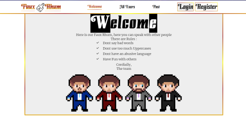

# Projet-Forum

## How to start the site

* First of all you have to run the main.go in the terminal

    - go run main.go

The used localhost is localhost:8000, so you need to go on "http://localhost:8000"

* Dont exitate to zoom-in or zoom-out your navigator screen with : ctrl + / ctrl - / ctrl scroll wheel.

------------------------

# Description 

Our project is a Forum, where you can speak with other people.

If you only want to see posts without put comments or likes, you can but if you want to comments or likes you need to create an account and to log in.

You can edit your profile for a better immersion.

Be careful there are rules to respect, and if you respect them and are active you may be able to be promoted.

They exist 3 roles, Admins , Moderator , and users.

------------------------


                                             
With this project, we learn for the Front **HTML**, **CSS**, **JavaScript** and **GO Templates**

And for the Back **GO**, **GO Templates** , **Data Base** ...

------------------------

## Authors

Code writted by *Captain* **PEYRE Brian**, **DOCKX Sven**, **BOUQUIER Baptiste**, **MORACCHINI Florian**

------------------------

## How does the page work

1. When you arrive on the index.html, you can see all the posts, you can have interactions with the posts.

2. You can create an account by cliking on the button *REGISTER* in the header.

3. After the creation of your count, click on the *LOGIN* button to Log in.

4. If you want you can edit your profil.

5. You can see informations about others users,and you can see all users to in the *All Users*.

6. And if you a newcomer go see our *Welcome* page ^^

------------------------

# DockerFile
  - Installer Docker https://docs.docker.com/get-docker/

  - Lancer Docker

  - Construire l'image du conteneur ```docker build -t forum-BPEYRE .```
  
  - Démarrer le conteneur ```docker run -dp 8000:8000 forum-bpeyre```

------------------------

## Algorithm detail

* We used the following method to code :

* The GO template, HTML, CSS and JS for the Front part of the project

* Golang for the back.

* SQLITE for the data base

------------------------

## END, thanks

## Cordially,

## Faux Rhum team

------------------------